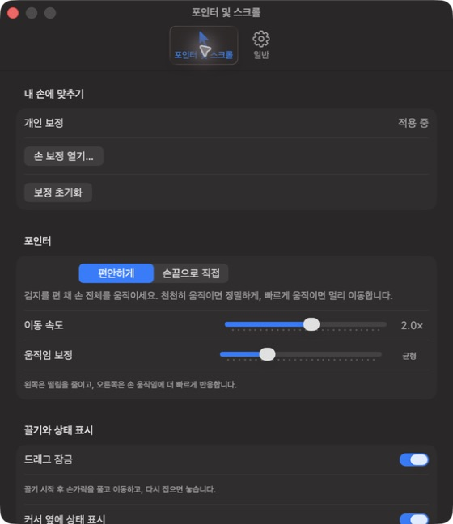
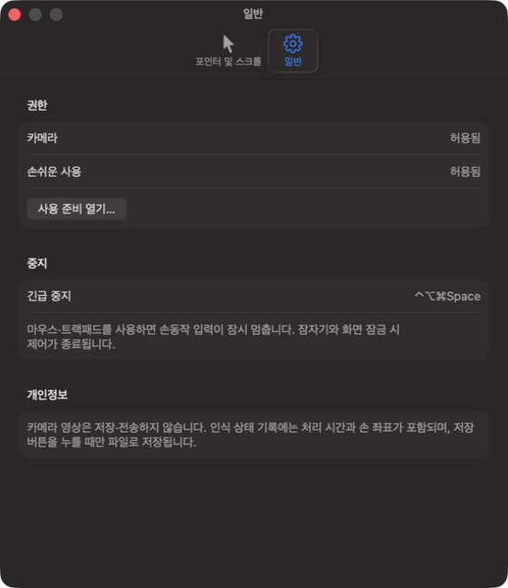
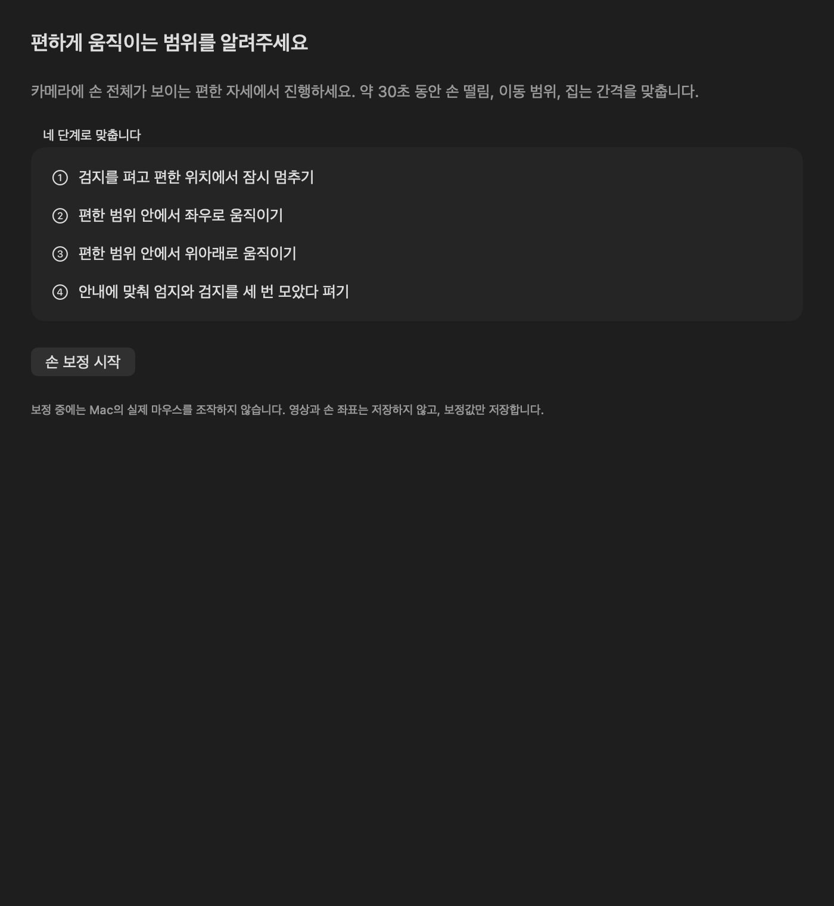
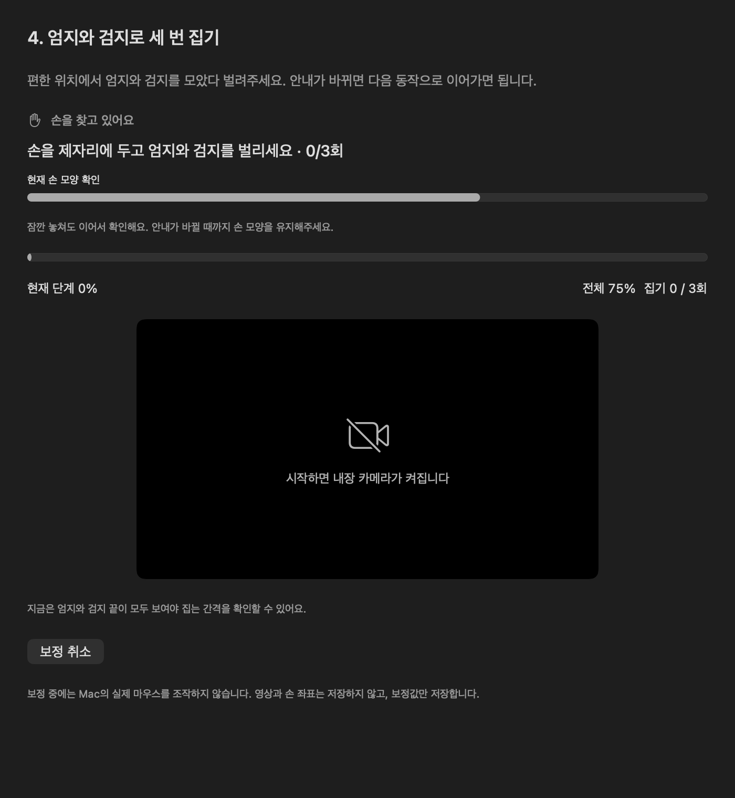
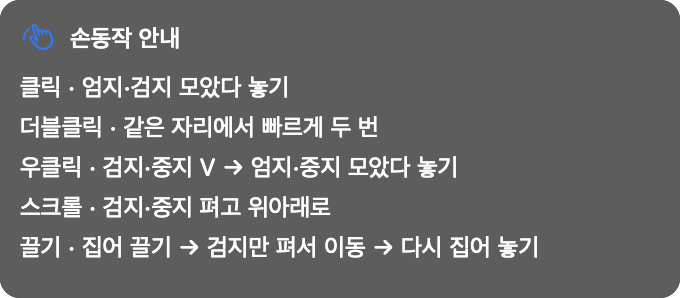
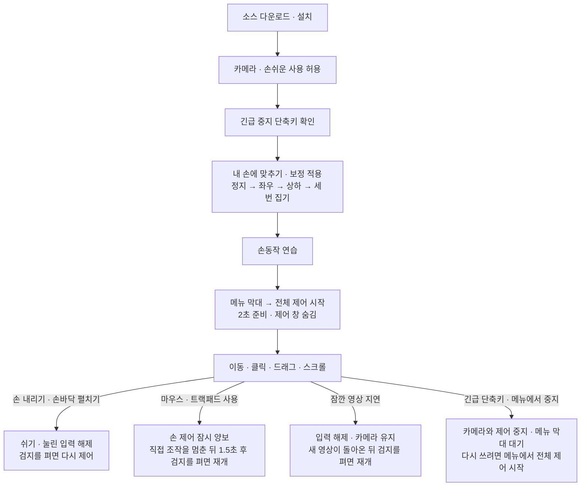

# AirTouch

**MacBook 내장 카메라로 마우스를 조작하는 macOS 메뉴 막대 앱.**

https://github.com/user-attachments/assets/aa1335e1-f21a-498e-ac71-764c9e1975ed

*실제 사용 영상 · 2026-09-19 · 약 23초*

검지를 펴서 커서를 움직이고, 손가락을 모아 클릭하고, 두 손가락으로 스크롤합니다. 별도 센서 없이 Apple Vision으로 손을 인식하고 macOS 전체에 마우스 입력을 전달합니다.

**현재 버전: v0.4.6 · macOS 14 이상 · Swift / SwiftUI / AppKit**

[설치](#설치) · [처음 사용하기](#처음-사용하기) · [사용 흐름](#사용-흐름) · [손동작](#손동작) · [변경 이력](CHANGELOG.md)

## 할 수 있는 일

- 커서 이동, 클릭·더블클릭·우클릭, 드래그, 세로 스크롤
- 손 떨림·이동 범위·집는 간격을 맞추는 개인 보정
- 계속 집고 있지 않아도 되는 드래그 잠금
- 커서 옆 동작 안내와 인식 상태 표시
- 실제 마우스를 건드리지 않는 앱 내부 연습

준비를 마치면 **메뉴 막대의 손 아이콘**에만 상주합니다. Dock이나 앱 전환기에 계속 나타나지 않으며, 제어 화면은 필요할 때만 엽니다. 전체 제어를 시작하면 창은 자동으로 숨겨집니다.

## 앱 화면

### 실제 실행 화면

설치된 **v0.4.5**의 설정 창을 직접 캡처했습니다. 촬영 당시의 개인 설정이 적용된 예시이며, 기본 설정값과 다를 수 있습니다.

#### 포인터 및 스크롤 설정

개인 보정, 조작 방식, 이동 속도, 움직임 보정과 드래그 잠금을 설정합니다. 아래는 설정 창에 보이는 상단 영역입니다.



#### 권한과 긴급 중지

카메라·손쉬운 사용 허용 상태와 긴급 중지 단축키를 확인합니다.



[스크린샷 촬영 정보](docs/images/README.md)

### UI 검증 이미지

아래 세 이미지는 앱의 SwiftUI 뷰를 렌더링한 검증 결과입니다. 실행 중인 설치 앱을 직접 캡처한 스크린샷이나 실제 카메라 인식 화면은 아닙니다.

#### 내 손에 맞추기



#### 엄지·검지 집기 확인



#### 커서 옆 동작 안내



## 설치

현재는 **소스를 받아 직접 빌드하는 개발 버전**입니다. 공증된 DMG나 일반 사용자용 설치 파일은 아직 제공하지 않습니다.

### 준비물

| 항목 | 요구사항 |
| --- | --- |
| 기기 | 내장 카메라가 있는 MacBook |
| 운영체제 | macOS 14 이상 |
| 개발 도구 | Swift 6 도구를 제공하는 Xcode. Xcode를 한 번 열어 초기 설정을 완료하세요. |
| 권한 | 카메라, 손쉬운 사용 |

외부 Swift 패키지 의존성은 없습니다. 실행한 Mac의 아키텍처에 맞춰 빌드합니다.

### 다운로드하고 설치하기

터미널에서 실행합니다. 비공개 저장소라면 접근 권한이 있는 GitHub 계정으로 인증해야 합니다.

```bash
git clone https://github.com/dusen0528/AirTouch.git
cd AirTouch
./scripts/install-app.sh
```

설치 스크립트가 빌드·서명 검증 후 **`~/Applications/AirTouch.app`**에 설치하고 자동 실행합니다. 설치가 끝나면 임시 앱과 이전 실행 파일 백업을 정리해 실행용 앱 하나만 남깁니다.

Xcode를 다른 위치에 설치했다면 경로를 지정합니다. Command Line Tools만 선택되어 있어도 표준 위치의 Xcode는 스크립트가 자동으로 사용합니다.

```bash
DEVELOPER_DIR=/경로/Xcode.app/Contents/Developer ./scripts/install-app.sh
```

### 업데이트

1. 메뉴 막대에서 **AirTouch 종료**를 선택합니다.
2. 저장소 폴더에서 아래 명령을 실행합니다.

```bash
git pull --ff-only
./scripts/install-app.sh
```

기존 설치 위치를 유지하며, 설치 도중 검증에 실패하면 이전 앱 내용을 복원합니다. 실행 중이라는 오류가 나오면 창을 닫는 대신 메뉴에서 앱을 완전히 종료하세요.

<details>
<summary>개발 서명과 권한 재등록</summary>

Apple Development 인증서가 하나 있으면 자동으로 사용하고, 없으면 ad-hoc 서명으로 빌드합니다. 인증서가 여러 개라면 사용할 인증서를 지정합니다.

```bash
AIRTOUCH_SIGN_IDENTITY='인증서 이름 또는 SHA-1' ./scripts/install-app.sh
```

같은 인증서를 유지하는 것이 업데이트 후 권한 인식에 유리합니다. ad-hoc 서명이나 서명이 바뀐 앱은 손쉬운 사용 권한을 다시 등록해야 할 수 있습니다. 외부 배포용 Developer ID 서명·공증은 이 설치 스크립트에 포함되지 않습니다.

</details>

## 처음 사용하기

처음 실행하거나 권한이 부족하면 **사용 준비** 화면이 나옵니다.

1. 설치 위치가 `~/Applications/AirTouch.app`인지 확인합니다.
2. **카메라 접근 허용…**을 누르고 macOS 요청에서 허용합니다.
3. **손쉬운 사용 설정 열기…** → **개인정보 보호 및 보안 → 손쉬운 사용**에서 AirTouch를 켭니다. 목록에 없다면 **+**로 설치한 앱을 추가합니다. **Finder에서 AirTouch 보기**로 위치를 찾을 수 있습니다.
4. **Control + Option + Command + Space** (`⌃⌥⌘Space`)를 눌러 긴급 중지가 동작하는지 확인합니다.
5. 준비를 마치면 **내 손에 맞추기**에서 보정하고, **손동작 연습**에서 움직임을 익힙니다.
6. 메뉴 막대의 손 아이콘 → **전체 제어 시작**을 누릅니다. 카메라가 켜지고 약 2초 준비 후 손동작 제어를 시작합니다.

권한은 사용자가 macOS에서 허용합니다. AirTouch는 설정에서 돌아왔을 때 권한 상태를 다시 확인합니다. 앱을 다시 켜도 카메라와 마우스 제어를 자동으로 시작하지 않습니다.

## 사용 흐름



보정과 연습은 권장 순서이며, 필수 권한이 갖춰지면 전체 제어를 바로 시작할 수도 있습니다.

### 내 손에 맞추기

**손 보정 시작**을 누른 뒤 화면의 안내를 따릅니다.

1. 검지를 펴고 잠시 멈춥니다.
2. 편한 범위 안에서 좌우로 움직입니다.
3. 위아래로 움직입니다.
4. 엄지·검지를 모았다 벌리는 동작을 세 번 확인합니다. **현재 손 모양 확인** 표시를 보며 안내가 바뀔 때까지 유지합니다.
5. **보정 적용**을 눌러 이 Mac에 저장합니다.

정상 관측 기준 약 30초이며 인식이 끊기면 더 걸릴 수 있습니다. v0.4.5에서는 집기 단계도 짧은 누락을 견디면서 정상 관측한 만큼 누적합니다. 길게 놓친 경우 미완료 동작을 다시 확인합니다. 보정 중에는 실제 마우스 입력을 보내지 않습니다.

## 손동작

기본 **편안하게** 모드는 검지를 편 채 **손 전체**를 움직입니다. 손끝만 구부리는 동작보다 손바닥을 함께 움직이는 것이 기본 조작 방식에 맞습니다.

| 하고 싶은 일 | 손동작 |
| --- | --- |
| 커서 이동 | 검지를 펴서 준비한 뒤 손 전체 이동 |
| 클릭 | 멈춘 뒤 엄지·검지 모았다 놓기 |
| 더블클릭 | 같은 자리에서 빠르게 두 번 모았다 놓기 |
| 우클릭 | 검지·중지를 V로 펼친 뒤 엄지·중지 모았다 놓기 |
| 세로 스크롤 | 검지·중지를 펴고 위아래 이동 |
| 드래그 잠금 | 집어서 끌기 시작 → 손가락을 풀고 이동 → 다시 집어서 놓기 |
| 쉬기 | 손바닥 펼치기 또는 손 내리기 |
| 완전히 중지 | `⌃⌥⌘Space` 또는 메뉴의 **전체 제어 중지** |

드래그 잠금을 끄면 드래그하는 동안 계속 집고 있어야 합니다. 커서 옆 안내는 준비 상태에서 동작 방법을 보여주고, 조작 중에는 작은 상태 표시로 줄어듭니다. **설정…**에서 조작 방식, 이동 속도, 움직임 보정, 스크롤 방향과 상태 표시를 조정할 수 있습니다.

마우스·트랙패드를 직접 사용하면 손 제어가 잠시 양보합니다. 직접 조작을 멈춘 뒤 1.5초 기다리고 검지를 펴면 이어집니다. 창을 닫아도 전체 제어는 계속되므로 중지는 단축키나 메뉴를 사용하세요. 카메라 연습·보정 중에 창을 닫으면 해당 세션은 멈춥니다.

v0.4.6부터 잠깐의 영상 지연으로 출력이 차단되면 눌린 입력을 풀고 카메라를 유지합니다. 새 영상이 돌아온 뒤 검지를 펴서 준비하면 이어서 조작합니다. 권한 철회·긴급 중지·화면 잠금이나 실제 카메라 세션 오류는 전체 제어를 중지하며, 원인을 해결한 뒤 직접 다시 시작해야 합니다.

## 잘 안 될 때

| 증상 | 확인할 내용 |
| --- | --- |
| 실행했는데 창이 안 보임 | 정상 대기 방식입니다. 메뉴 막대 손 아이콘 → **제어 화면 열기…**를 선택하세요. |
| 권한을 켰는데 계속 ‘허용 필요’ | 앱을 종료한 뒤 손쉬운 사용의 이전 AirTouch 등록을 제거하고 현재 설치 앱을 다시 추가하세요. 특히 앱 경로·서명이 바뀐 경우 확인이 필요합니다. |
| 설치 중 실행 중인 앱이라는 오류 | 창 닫기 대신 **AirTouch 종료** 후 다시 설치하세요. |
| 집기 보정이 잘 진행되지 않음 | 엄지와 검지가 모두 보이게 하고, ‘현재 손 모양 확인’과 주 안내가 바뀔 때까지 자세를 유지하세요. |
| 손동작을 멈추고 싶음 | `⌃⌥⌘Space`로 카메라와 제어를 즉시 중지하세요. |

문제 확인이 필요하면 **인식 상태 → 인식 기록 저장**을 사용합니다. 이 JSON에는 손 좌표·관절 신뢰도·타이밍 등이 들어갈 수 있으므로 원본을 공개 이슈나 저장소에 올리지 마세요. 영상은 저장하지 않습니다.

## 개발과 검증

```bash
./scripts/test.sh
```

앱 내부 **데모 재생**은 카메라 없이 합성 좌표로 입력 엔진을 실행합니다. 실제 macOS 입력은 보내지 않습니다. 앱을 완전히 종료한 상태라면 다음 명령으로 결과를 저장할 수도 있습니다.

```bash
open ~/Applications/AirTouch.app --args --demo --demo-report /tmp/airtouch-demo.json
```

v0.4.6 검증 기록은 **자동 테스트 161개 통과·사용자 원본이 필요한 2개 건너뜀**입니다. 합성 입력 테스트, 실제 카메라 캡처, 대상 앱의 실제 입력 성공과 사용감은 서로 다른 검증 범위입니다. 세부 조건은 [v0.4.6 복구 검증](docs/verification/v046-system-recovery.md), [v0.4.5 보정 검증](docs/verification/v045-pinch-continuity.md)과 [v0.4.4 카메라 검증](docs/verification/v044-camera-and-calibration.md)을 참고하세요.

### 구조

```text
내장 카메라 (AVFoundation)
  → 손 관절 인식 (Apple Vision)
  → 자세 · 필터 · 보정 · 제스처 상태 머신 (AirTouchCore)
  → 마우스 · 스크롤 입력 (CoreGraphics)

SwiftUI / AppKit: 메뉴 막대 · 설정 · 연습 · 보정 · 커서 상태 표시
```

UI와 분리된 영상 처리·입력 큐를 사용합니다. 오래된 프레임, 권한 철회, 손 인식 중단에는 입력을 차단하거나 눌린 상태를 해제합니다.

현재 지원하지 않는 동작은 가로 스크롤, 확대·축소, 회전, Mission Control·데스크톱 전환, Force Touch, 문자 입력, 브라우저 뒤로·앞으로, 여러 화면 간 자동 전환입니다. 제어할 화면 하나를 선택하는 방식입니다. macOS 헤드 포인터·표정 제어 연동은 [조사 단계](docs/research/README.md)이며 현재 앱에 통합된 기능은 아닙니다.

## 문서와 버전

- [변경 이력](CHANGELOG.md) · 기능별 한글 커밋과 릴리스 태그
- [제품·기술 설계](docs/airtouch-design.md)
- [구현·검증 현황](docs/implementation-status.md)
- [검증 계획](docs/validation-plan.md)
- [검색 유입·ASO 준비](docs/aso/README.md)
- [개발 규칙](AGENTS.md)

복원 가능한 소스 이력은 v0.3.1부터입니다. 그보다 앞선 문서는 당시 실행·검증 기록입니다.
