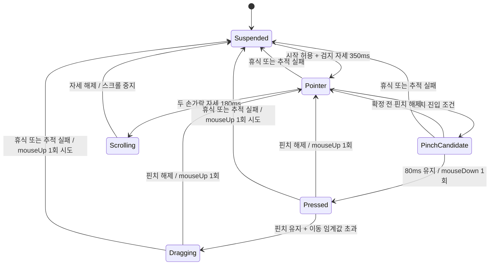

# AirTouch 제품·기술 설계 v0.2

작성일: 2026-09-15. 사용자 원안을 실행 가능한 제품 설계로 구체화한 제안이다. 모든 임계값과 성능 수치는 실험 시작값 또는 목표이며, 측정 결과가 아니다.

## 1. 제품 목표와 사용 장면

**MacBook 내장 카메라만으로, 손을 편하게 든 상태에서 macOS의 짧은 조작을 끝낸다.**

먼저 검증할 장면은 문서를 읽으며 스크롤하기, 링크나 큰 버튼 누르기, 창 옮기기다. 장시간 정밀 편집과 문자 입력은 첫 버전의 성공 조건에 포함하지 않는다. 요리 중 조작도 손에 든 물건과 손가락 가림을 별도로 검증하기 전까지 대표 사용 사례로 내세우지 않는다.

장치에 접촉하지 않는 조작을 뜻하며, 손을 움직이지 않아도 되는 접근성 기능을 뜻하지는 않는다. 접근성 용도로 확장할 때에는 대상 사용자의 동작 범위와 피로도를 별도로 평가한다.

초기 지원 범위는 Apple Silicon MacBook, macOS 14 이상, 내장 카메라, 선택한 모니터 한 대다. 이는 개발 범위를 위한 제안이며 API의 최소 지원 버전 선언이 아니다. 연결된 외부 모니터를 대상으로 선택할 수 있지만 모니터 사이를 넘나드는 동작은 후속 기능이다.

## 2. 원안에서 바꾸는 결정

| 원안 | 변경 | 이유 |
| --- | --- | --- |
| MediaPipe Tasks를 Swift 앱에 바로 도입 | Apple Vision으로 먼저 구현 | Google의 확인한 Swift 가이드는 iOS용이다. 네이티브 macOS 통합 비용을 먼저 피한다. |
| 화면 해상도 × 검지 좌표 | 기본은 상대 이동과 재기준 설정 | 손을 편한 위치로 옮겨도 커서가 순간 이동하지 않게 한다. |
| 거리 0.04 이하면 핀치 | 손 크기로 정규화하고 진입·해제 임계값을 분리 | 카메라 거리 변화와 경계 부근 진동에 대응한다. |
| 클릭 실행 후 계속 유지하면 드래그 | 하나의 down–dragged–up 수명주기 | 드래그 전에 클릭이 따로 발생하는 충돌을 없앤다. |
| 손바닥으로 스와이프와 ON/OFF | 첫 버전의 손바닥은 쉬기 전용 | 한 동작의 의미를 하나로 유지한다. |
| 마지막 단계에서 필터·상태 머신 추가 | 실제 입력 연결 전에 구현 | 처음부터 재현 가능한 입력 계약을 만든다. |

Apple은 Vision 손 포즈 요청과 관절별 인식 결과를 제공한다. Google의 Hand Landmarker Swift 예제는 iOS 앱과 CocoaPods 의존성을 설명한다. 이를 근거로 Vision을 초기 구현에 선택하며, 어느 엔진이 더 정확하거나 빠르다는 결론은 아직 내리지 않는다. [Apple Vision](https://developer.apple.com/documentation/vision/vndetecthumanhandposerequest), [Google iOS 가이드](https://developers.google.com/edge/mediapipe/solutions/vision/hand_landmarker/ios)

## 3. 첫 버전의 조작 규칙

| 사용자 동작 | 앱 반응 | 피드백 |
| --- | --- | --- |
| 메뉴에서 제어 시작 | 카메라 시작, 준비 상태 진입 | “검지를 펴면 시작합니다” |
| 검지를 편 자세를 안정적으로 유지 | 현재 손 위치와 현재 커서를 기준으로 제어 시작 | 커서 옆 작은 상태 링 |
| 검지를 움직임 | 상대 변위로 커서 이동 | 이동 상태 |
| 엄지와 검지를 모음 | 핀치 후보 동안 커서 고정, 확정하면 버튼 누름 | 링이 채워짐 |
| 핀치를 풀음 | 버튼을 뗌 | 클릭 완료 표시 |
| 핀치를 유지하며 손을 이동 | 같은 버튼을 누른 채 드래그 | 드래그 표시 |
| 검지·중지를 펴서 유지한 뒤 상하 이동 | 커서를 고정하고 세로 스크롤 | 스크롤 표시 |
| 손바닥을 펴거나 손을 내림 | 입력을 멈추고 쉬기 상태로 진입 | “일시정지” 또는 “손을 찾는 중” |
| 검지를 다시 펴서 유지 | 새 손 위치를 기준으로 재개 | 기존 커서 위치 유지 |
| 메뉴에서 완전히 끄기 | 눌린 입력 해제 시도 후 카메라 세션 종료 | 카메라 꺼짐 |

손바닥은 카메라를 끄는 동작이 아니다. 쉬기 상태에서도 재개 동작을 보기 위해 카메라가 필요하다. 카메라가 완전히 꺼진 상태에서는 손동작만으로 다시 켤 수 없다.

더블클릭, 우클릭, 가로 스크롤, 스와이프, 미디어 키, 앱별 프로필은 기본 조작의 통과 기준을 달성한 뒤 추가한다. 따라서 첫 버전에서 Finder의 모든 일반 작업을 손동작만으로 끝낼 수 있다고 약속하지 않는다.

## 4. 활성화와 제스처 충돌 방지

앱 시작 직후에는 OS 입력을 보내지 않는다. 사용자가 제어 시작을 선택한 후, 지정한 영역에서 검지를 편 자세가 350ms 유지되면 제어를 시작한다. 정지 이후에도 같은 조건으로 재개하며 핀치를 한 채로는 활성화되지 않는다.

처리 우선순위는 다음과 같다.

1. 종료·권한 이상·카메라 중단·입력 데이터 만료: 새 입력 차단 및 눌린 입력 정리.
2. 이미 누른 버튼의 수명주기: 스크롤이나 새 명령으로 전환하지 않음.
3. 손바닥 휴식 또는 추적 불확실성: 이동 중지.
4. 확정된 스크롤 자세.
5. 포인터 이동 및 새로운 핀치 후보.

핀치로 손 모양이 달라졌다는 이유만으로 포인터 자세 상실로 판단하지 않는다. 각 상태가 필요한 관절과 유효 조건을 별도로 가진다. 손바닥 휴식은 눌린 버튼을 먼저 해제하는 종료 전이로 처리한다.

처음 안정적으로 선택한 손에 추적 잠금을 둔다. 이전 손바닥 위치·크기·이동 가능 범위로 연속성을 판단하고, 모델 결과 배열의 첫 손을 매번 선택하지 않는다. 두 손을 구분하기 어려우면 제어를 멈춘다. handedness만으로 동일한 사람의 손이라고 판단하지 않는다.

## 5. 클릭과 드래그: 이벤트 계약

클릭은 별도의 반복 명령이 아니라, 이동 없는 버튼 누름과 해제의 결과다. 핀치를 확정했을 때 `leftMouseDown`을 한 번 보내고, 해제했을 때 `leftMouseUp`을 한 번 보낸다. 이동이 드래그 임계값을 넘으면 그 사이에 `leftMouseDragged`를 보낸다. CoreGraphics는 일반 이동과 드래그를 별도 이벤트로 정의한다. [CGEventType](https://developer.apple.com/documentation/coregraphics/cgeventtype)



카메라·권한·세션 오류는 모든 상태에서 Suspended로 빠지는 공통 전이이며, 그림에서는 일부 선을 생략했다.

핀치 후보가 시작되면 마지막 안정된 커서 위치를 누름 위치로 저장한다. 손가락을 모으는 동안의 검지 끝 이동은 커서에 반영하지 않는다. 확정 이후에는 손목과 손가락 기저 관절로 계산한 손바닥 기준점의 이동을 사용한다. 드래그 임계값은 누름 이후 누적 이동 8 화면 좌표 단위부터 실험하며, 손목 이동과 핀치 변형을 구분할 수 있는지 검증한다.

드래그 전환 시 임계값만큼 커서가 갑자기 뛰지 않도록 임계값 초과분부터 이동한다. 해제 후 포인터용 손 위치를 다시 기준으로 잡는다. 오래 핀치했다는 이유만으로 드래그를 시작하지 않는다.

`Pressed` 진입 시점에 이미 OS에 버튼을 눌렀으므로, 그 이후 손을 잃어 버튼을 떼는 것은 “클릭 취소”가 아니다. 앱에 따라 클릭이나 드롭이 완료될 수 있다. 이 동작을 되돌리는 일반적인 OS 이벤트는 가정하지 않는다. 첫 실험은 앱 안의 연습 영역에서 하고, 복구 시 “입력 해제됨”을 표시한다.

더블클릭을 추가할 때에는 OS의 더블클릭 시간 설정, 위치 허용 범위, 이벤트의 클릭 횟수 필드를 함께 처리한다. 일괄적인 긴 cooldown으로 두 번째 클릭을 막지 않는다.

## 6. 손 모양 판정

가로·세로가 각각 0~1인 영상 좌표에서 그대로 유클리드 거리를 구하면 화면비에 따라 거리가 왜곡된다. 방향 보정 후 영상의 너비·높이를 반영한 좌표로 거리를 계산한다.

```text
p_metric = (x_normalized × imageWidth, y_normalized × imageHeight)
palmScale = distance(wrist, middleMCP)
pinchRatio = distance(thumbTip, indexTip) / palmScale

핀치 진입 후보: pinchRatio < 0.25
핀치 해제 후보: pinchRatio > 0.38
두 값 사이: 이전 상태 유지
```

위 수치는 초기 실험값이다. 손바닥 기준 길이가 너무 작거나 필요한 관절의 confidence가 낮으면 판정을 하지 않는다. 손 회전에 의한 원근 왜곡은 2D 비율만으로 제거되지 않으므로, 카메라를 향한 편한 손 자세에서 검증하고 허용 자세 범위를 정한다.

펴진 손가락은 단순히 끝점의 y좌표가 높다는 조건 대신 관절 각도와 손바닥 축에 대한 상대 위치로 판정한다. 스크롤은 검지·중지 펴짐, 약지·소지 접힘, 핀치 아님을 함께 요구한다.

프레임 수 대신 단조 증가 시간으로 유지 시간을 계산한다. 관절 confidence는 “정확도 96%”로 표시하지 않는다. 사용자에게는 “안정적”, “손 전체를 보여주세요”, “너무 멀어요”처럼 행동 가능한 상태를 보여준다.

## 7. 커서: 상대 이동, 필터, 좌표계

기본 모드는 공중에서 쓰는 트랙패드처럼 동작한다. 활성화 순간의 손 위치와 현재 OS 커서 위치를 짝지으며, 이후 손의 상대 변위를 누적한다. 손을 쉬었다 올리면 새로운 기준을 설정한다.

```text
유효한 관절
→ 영상 방향·반전 보정
→ 급격한 이상 좌표 배제
→ One Euro Filter
→ 손의 상대 변위
→ 감도와 연속적인 속도 이득
→ 작은 변위 누적 및 정지 떨림 억제
→ 선택한 화면 경계 제한
→ InputIntent
```

`cursor(t) = clamp(cursor(t-1) + gain(speed) × normalizedHandDelta)`

gain에는 화면 크기와 감도 변환을 포함한다. 손 크기 기준은 제어 시작 때 안정된 값으로 잡고, 움직이는 도중 매 프레임 바꾸어 감도가 흔들리지 않게 한다. 경계에 막힌 이동량은 계속 누적하지 않는다.

고정 dead zone으로 작은 이동을 매번 버리면 미세 조작이 안 된다. 출력하지 않은 작은 변위를 누적하고, 정지 진입·이탈 임계값을 분리한다. 필터 자체의 속도 대응과 커서 가속을 별도로 튜닝하며 첫 실험에서는 가속을 끈다. One Euro Filter의 최소 cutoff와 beta는 데이터 단위에 따라 조정한다. [원 저자의 튜닝 가이드](https://gery.casiez.net/1euro/)

원안의 Active Zone은 기본 모드에서 손이 편하게 머무를 범위와 재활성화 영역으로 사용한다. 그 영역 전체를 화면 전체에 직접 매핑하지 않는다. 절대 좌표 매핑은 비교 실험 모드로 남기며, 상대 이동보다 목표 선택과 피로 평가가 좋을 때 기본값을 바꾼다.

좌표계 계약은 다음과 같다.

- Vision 관절 좌표, 카메라 프리뷰 좌표, CoreGraphics 전역 좌표를 각각 구분한다.
- 거울 프리뷰와 입력 반전은 하나의 변환 규칙을 공유한다. 프리뷰만 뒤집고 실제 제어는 반대로 움직이는 오류를 막는다.
- 화면 크기는 패널의 물리 픽셀 수를 하드코딩하지 않는다. `CGDisplayBounds`가 제공하는 전역 디스플레이 좌표를 입력 이벤트와 일관되게 사용한다.
- AppKit의 화면 좌표와 섞을 때에는 원점과 y축 방향 변환을 명시한다. Retina 배율을 임의로 한 번 더 곱하지 않는다.
- 외부 화면의 음수 원점, 배율 변경, 연결 해제 시에는 매핑을 초기화하고 재활성화를 요구한다.

Apple의 Vision 예제는 Vision 좌표에서 AVFoundation 좌표로 y축을 변환하며, `CGDisplayBounds`는 주 디스플레이의 왼쪽 위를 기준으로 한 전역 경계를 반환한다. [Vision 예제 설명](https://developer.apple.com/videos/play/wwdc2020/10653/), [CGDisplayBounds](https://developer.apple.com/documentation/coregraphics/cgdisplaybounds(_:))

## 8. 스크롤

스크롤 자세를 180ms 유지하면 커서와 손의 시작 위치를 고정한다. 진입 중 움직인 거리는 버리고, 진입 이후 검지·중지 기저 관절 중심의 세로 변위만 스크롤로 바꾼다.

초기 모드는 손의 이동량만큼 이동하는 방식이다. 손을 멈추면 스크롤도 멈춘다. 중립점에서 벗어난 거리만으로 계속 스크롤하는 속도 모드와 관성은 후속 실험으로 둔다. 이를 통해 정지 조건을 단순하게 유지한다.

방향은 보정 화면에서 위·아래를 한 번씩 움직여 설정하고, 사용자가 반전할 수 있게 한다. 자연스러운 스크롤 설정과 중복 반전되는지 실제 브라우저와 문서 앱에서 확인한다. 자세 해제 시 남은 소수 이동량을 지우고 쉬기 상태로 돌아가며, 검지 자세로 재활성화할 때 기준점을 새로 잡는다.

## 9. 추적 실패와 제어권 복구

손이 가려지거나 영상 가장자리로 나가면 관절 검출이 불안정할 수 있다. Apple도 손 포즈 검출의 가림과 영상 가장자리 조건을 설명한다. [Apple의 정확도 고려 사항](https://developer.apple.com/videos/play/wwdc2020/10653/)

| 상황 | 반응 |
| --- | --- |
| 낮은 confidence 또는 잘못된 관절 조합 | 해당 프레임의 이동·스크롤·새 누름 금지 |
| 유효한 손이 없는 상태가 120ms 지속 | 눌린 입력 해제 시도, Suspended 진입 |
| 마지막 영상이 200ms 이상 오래됨 | 독립 watchdog이 입력 정리, 카메라 상태 안내 |
| 카메라 중단·권한 철회·잠자기·화면 잠금 | 즉시 입력 정리 시도, 자동 제어 재개 금지 |
| 복구 후 손 재발견 | 오래된 필터·핀치·스크롤 기준 폐기, 활성화 자세 재확인 |
| 선택 화면 연결 해제 | 입력 정리 후 재선택 안내 |
| 종료 또는 사용자의 중지 요청 | 눌린 입력 정리 후 세션 종료 |

120ms 이내에 손이 돌아오더라도 좌표 연속성이 확인된 같은 손만 이어서 처리한다. 그렇지 않으면 즉시 정리하고 재활성화를 요구한다. 프레임을 받지 못할 때도 watchdog이 실행되도록 추론 작업과 분리한다.

정상 실행 중에는 `InputDispatcher`가 자신이 누른 버튼·키를 기록해 중복 down/up을 막는다. `releaseAll(reason:)`은 여러 번 호출해도 중복 입력을 만들지 않는다. 권한 철회 후의 이벤트 전송 성공이나 프로세스 강제 종료 때의 정리 실행은 보장할 수 없으므로 별도 장애 실험으로 확인한다.

전역 중지 단축키는 초기 구현에 포함하고, 앱 창에 포커스가 없어도 작동하는지 검증한다. 물리 마우스·트랙패드 입력이 들어오면 잠시 제어를 양보하는 기능은 베타 통과 조건으로 둔다. 입력 관찰 방식에 필요한 권한과 합성 이벤트 식별을 먼저 검증해 자기 이벤트를 사용자 조작으로 오인하지 않게 한다.

## 10. 구현 구조

```text
AVFoundation → FrameScheduler → VisionHandTracker → HandObservation
                                                    ↓
                                    GestureEngine + PointerController
                                                    ↓
                                              InputIntent
                                                    ↓
                              InputDispatcher / RecordingInputSink
                                                    ↓
                                       CGEvent 또는 연습 화면

SessionCoordinator → 권한·카메라·화면·중지·watchdog 상태 관리
UI                ← 상태 스냅샷과 진단값 구독
```

| 모듈 | 책임과 경계 |
| --- | --- |
| CameraSession | 내장 카메라 선택, 허용 포맷, 시작·중단, 타임스탬프 |
| FrameScheduler | 추론 1개만 실행, 최신 프레임 우선, 지연·드롭 측정 |
| HandTracker | 영상에서 관절·confidence·시간 반환. OS 입력 권한 없음 |
| GestureEngine | 이전 상태 + 관측 + 시간으로 상태와 의도 생성. 카메라·CGEvent에 의존하지 않음 |
| PointerController | 좌표 변환, 필터, 상대 이동, 경계 처리 |
| InputDispatcher | 단일 직렬 실행 경로에서 이벤트 생성, 눌린 입력 소유권과 해제 관리 |
| SessionCoordinator | 시작·중지, 오류, 화면 변경, watchdog, 세션 세대 번호 |
| CalibrationStore | 손 설정·감도·영역·화면 식별자·스키마 버전 저장 |
| Diagnostics | 지연 분포, 상태 전이, 정지 이유, 선택적 랜드마크 기록 |

첫 버전은 하나의 앱 프로세스와 작은 모듈로 만든다. 별도 서버, 메시지 브로커, 플러그인 프레임워크는 필요하지 않다. `HandTracker`와 입력 sink만 교체할 수 있게 해 엔진 비교와 재생 검증에 활용한다.

`HandObservation`에는 sequence, captureTimestamp, processingFinishedTimestamp, sessionGeneration, 관절 및 confidence를 넣는다. OS 입력 직전에 세션 세대와 최신성을 다시 검사한다. 중지 전에 시작한 추론 결과가 늦게 도착해 커서를 움직이면 안 된다.

캡처 시작 후보는 기기가 지원하는 720p·30fps이며, 지원 포맷을 확인해 선택한다. 추론 backlog를 쌓지 않고, 캡처 출력의 `alwaysDiscardsLateVideoFrames`와 앱 자체의 최대 1개 대기 프레임 정책을 함께 사용한다. Apple도 최신 프레임 우선 처리와 늦은 프레임 폐기를 설명한다. [Apple 카메라 캡처 세션](https://developer.apple.com/videos/play/wwdc2021/10047/)

UI는 프레임마다 전체 상태를 다시 렌더링하지 않고, 카메라 프리뷰와 진단값 갱신 주기를 분리한다. 메뉴를 닫았을 때 프리뷰 렌더링은 중단하되 제어에 필요한 카메라와 추론은 유지한다.

## 11. 처음 실행했을 때의 흐름

1. 카메라 사용 목적과 로컬 처리를 설명하고 권한을 요청한다.
2. 손 전체가 보이는 위치에서 왼손·오른손, 편한 작업 영역을 설정한다.
3. 정지 2초, 작은 이동, 핀치·해제 반복으로 초기 감도를 잡는다. 실패하면 구체적인 자세 안내를 보여준다.
4. 앱 안 연습 화면에서 목표 누르기, 상자 끌기, 문서 스크롤을 수행한다. 이 단계는 실제 OS 입력을 보내지 않는다.
5. 시스템 제어용 손쉬운 사용 권한을 안내하고 실제 입력 가능 여부를 확인한다.
6. 제어 시작과 중지 방법을 확인한 뒤 OS 제어를 켠다.

영상은 기본적으로 저장·업로드하지 않는 구조로 설계한다. 진단 기록은 사용자가 켠 세션의 랜드마크·시간·상태 전이만 로컬에 저장하고 삭제 기능을 제공한다. 원본 영상 수집은 재현 실험을 위해 별도로 켰을 때만 사용한다.

카메라 요청과 입력 제어 권한을 구분한다. 초기 기능에는 마이크나 화면 녹화가 필요하지 않다. 물리 입력 관찰을 추가할 때에는 사용 API에 따른 입력 모니터링 필요 여부를 확인한다. 베타 배포 전에는 서명한 앱에서 권한 유지와 재실행을 검증한다.

메뉴바에는 상태와 중지 동작을 가장 먼저 둔다. 상태는 “꺼짐 / 준비 / 제어 중 / 일시정지 / 손을 찾는 중 / 권한 필요 / 카메라 오류”로 구분한다. 일반 설정에는 감도, 안정화, 스크롤 방향, 제어 손, 대상 화면을 노출하고 관절 임계값은 진단 설정에 둔다.

## 12. 개발 순서와 완료 조건

| 단계 | 만드는 것 | 다음 단계로 넘어갈 조건 |
| --- | --- | --- |
| 0. 감지 가능성 | 카메라·Vision·손 골격·추론 시간 표시 | 실제 기기에서 편한 자세의 필수 관절을 안정적으로 얻음 |
| 1. 입력 없는 제어 | 순수 상태 머신·필터·RecordingInputSink·연습 화면 | 재생 데이터에서 이벤트 계약 및 정지 규칙 통과 |
| 2. OS 포인터 | 상대 이동·활성화·휴식·전역 중지 | 재활성화 점프 없이 화면 목표 도달 |
| 3. 클릭·드래그 | 단일 버튼 수명주기·독립 watchdog | 반복 클릭 없음, 실패 시 입력 해제와 재활성화 확인 |
| 4. 스크롤 | 자세 전환·방향·이동량·종료 | 커서 이동과 스크롤의 동시 발생 없음 |
| 5. 실사용 베타 | 설정 저장·권한 복구·물리 입력 양보·서명 앱 | 실제 과제 및 장애 조건을 기록하고 기준 통과 |

고정된 일정을 약속하기보다 단계 0과 1의 결과로 나머지를 산정한다. 가장 불확실한 것은 코드 작성량보다 내장 카메라에서의 가림, 팔 피로, 핀치 중 목표 위치 유지다.

## 13. 후속 확장 판단

베타 이후 우선순위는 우클릭·더블클릭, 빠른 스크롤, 모니터 전환 순으로 실제 사용 로그를 보고 정한다. 손바닥 스와이프와 앱별 단축키는 반복 클릭·모드 충돌이 충분히 줄어든 뒤 추가한다.

앱별 프로필은 최전면 앱을 확인하고, 등록된 앱에서만 명령을 실행한다. Safari가 전면이라는 사실만으로 YouTube가 열려 있거나 텍스트 입력 중이 아니라고 판단할 수 없으므로 `Space`, `J`, `K`, `L`을 무조건 전송하지 않는다. 초기 미디어 프로필은 사용자가 명시적으로 선택하고 상태를 표시하는 방식부터 검증한다.

제품의 첫 데모는 “손 추적 골격이 나온다”에서 끝나지 않는다. 손을 올려 링크를 누르고, 문서를 스크롤하고, 창을 옮기고, 손을 내렸다 다시 올려 같은 커서 위치에서 이어가는 장면까지 하나의 흐름으로 보여준다.
